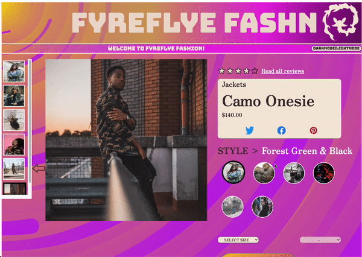
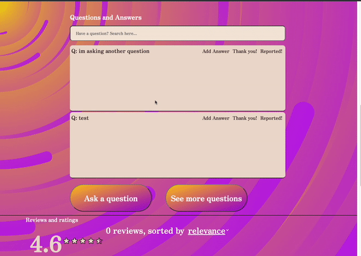
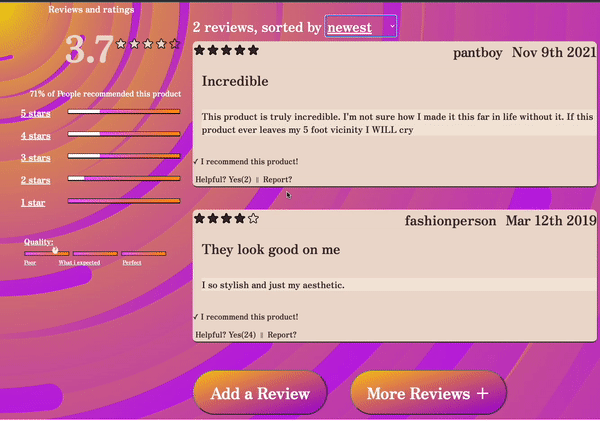
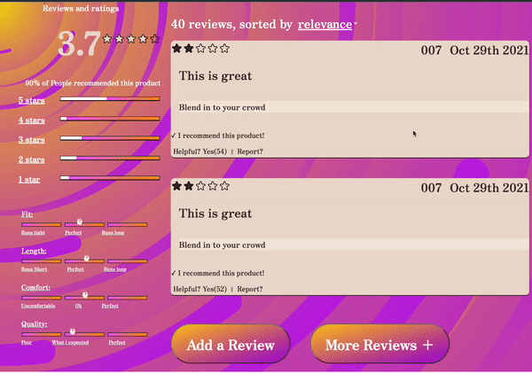

# FYREFLYE FSHN 🔥

### Table of Contents 🏓
1. [Overview](#overview)
2. [Installation](#installation 🔨)
3. [Usage](#usage)
4. [Requirements](#requirements)
5. [Contributors](#contributors)

### Overview
A front-end focused project providing a user interface for customers to browse products in a retail catalog.

### Technologies
* Axios : Version 0.24.0
* Express : Version 4.17.1
* Moment : Version 2.29.1
* NodeJS : Version 14.17.5
* Nodemon : Version 2.0.14
* React : Version 17.0.2
* ReactDOM : Version 17.0.2
* ReactFileReader : Version 1.1.4
* Styled-components : Version 5.3.3

### Installation 🔨
```
$ git clone https://github.com/Team-Asok/hackreactor-front-end-capstone-.git
$ cd ../hackreactor-front-end-capstone-.git
$ npm install
$ npm run build
$ npm start
```
Set up a config.js with the following:

* TOKEN (from GitHub):

### Usage-👍

### Overview:

DarkMode / LightMode Button:


Image Gallery:


Read All Reviews Button:


Social Media Buttons:



Styles Selector / Add To cart:


## Q and A

Q&A Search Bar:


Add Question / Add Answer:


Mark Helpful / Report:


See More Questions:



## Ratings and Reviews

Sort Reviews:


Filter by Star Rating:



See More Reviews:




### Contributors 🫂
- [James Plier](https://www.linkedin.com/in/james-plier-ab9900107/)
- [Kim Honrada](https://www.linkedin.com/in/kimhonrada21/)
- [Thomas Rose](https://www.linkedin.com/in/thomas-rose1990/)
